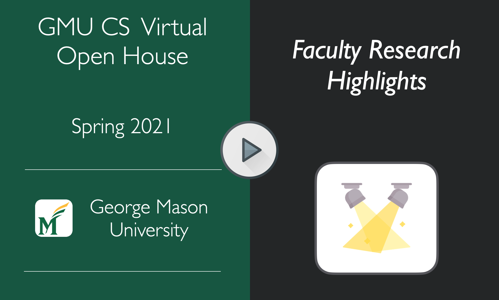

---
hide:
  - navigation   
---

This page contains information about each of the faculty who have agreed to meet with Ph.D. students, including a short description of their research, their availability, and the Zoom link to join their virtual meeting room.

!!! note ""
    **Important!** All times are displayed in your local time zone. You can download a PDF version of the schedule with all times in EST [here](../images/faculty-schedule-est.pdf).
    

### Dr. Antonios Anastasopoulos

<table width="100%">
	<tr>
		<th width="50%"> <h3>Assistant Professor</h3> </th>
	</tr>
	<tr>
		<td width="50%">
			&nbsp;&nbsp; 
			<ul>
				<li style="font-size:14px";><b>Bio:</b> Antonis Anastasopoulos is an assistant professor at George Mason Computer Science. He is interested in various aspects of multilingual Natural Language Processing and Machine Learning, with a main focus on Machine Translation and Speech Recognition for endangered languages and low-resource settings in general.</li>
				<li style="font-size:14px";><b>Website:</b> <a href="http://cs.gmu.edu/~antonis/">http://cs.gmu.edu/~antonis/</a></li>
				<li style="font-size:14px";><b>Email:</b> <a href="mailto:antonis@gmu.edu">antonis(at)gmu.edu</a></li>
				<li style="font-size:14px";><b>(Virtual) Office Hours:</b>   <b id="antonis1"></b> - <b id="antonis2"></b> </li>
				<li style="font-size:14px";><div">
<a href="https://gmu.zoom.us/j/93837371166" title="Office Hours" class="md-button md-button--primary">Join Office Hours </a>

</li>
			<ul>
			
			<h4 style="text-align: center;">Research Video Presentation</h4>
			

   

    
<iframe src='https://www.youtube.com/embed/xxyrJimxJYg' frameborder='0' allowfullscreen></iframe>

			
		</td>
	</tr>
</table>

---

<!--------------------------------------------------------------------------------->

### Dr. Foteini Baldimtsi

<table width="100%">
	<tr>
		<th width="50%"> <h3>Assistant Professor</h3> </th>
	</tr>
	<tr>
		<td width="50%">
			&nbsp;&nbsp; 
			<ul>
				<li style="font-size:14px";><b>Bio:</b> I am an assistant professor in the Computer Science Department at George Mason University. My research interests are in cryptography, security and data privacy with a special focus in signature schemes, accumulators, ZK proofs, private authentication techniques and blockchain technologies. My research is supported by NSF, NSA, DHS and Facebook and IBM faculty award. I received my Ph.D. from Brown University in May 2014 where I was supervised by Anna Lysyanskaya. During my time at Brown I was fortunate to spent a semester at Microsoft Research in Redmond, WA working in the Cryptography group with Melissa Chase and a summer at IBM Research in Zurich working as a member of the Cryptography and Security group. From 2014 to 2016 I was a postdoctoral researcher in the BU Security group at Boston University and also had a research affiliation with the Crypto.Sec group at University of Athens.</li>
				<li style="font-size:14px";><b>Website:</b> <a href="http://cs.gmu.edu/~foteini/">http://cs.gmu.edu/~foteini/</a></li>
				<li style="font-size:14px";><b>Email:</b> <a href="mailto:foteini@gmu.edu">foteini(at)gmu.edu</a></li>
				<li style="font-size:14px";><b>(Virtual) Office Hours:</b>   <b id="foteini1"></b> - <b id="foteini2"></b> </li>
				<li style="font-size:14px";><div">
<a href="https://gmu.zoom.us/j/93140508277" title="Office Hours" class="md-button md-button--primary">Join Office Hours </a>

</li>
			<ul>
			
			<h4 style="text-align: center;">Research Video Presentation</h4>
			

   

    
<iframe src='https://www.youtube.com/embed/QYJdbcRp8aY' frameborder='0' allowfullscreen></iframe>

			
		</td>
	</tr>
</table>

---

<!--------------------------------------------------------------------------------->

### Dr. Alex Brodsky

<table width="100%">
	<tr>
		<th width="50%"> <h3>Professor</h3> </th>
	</tr>
	<tr>
		<td width="50%">
			&nbsp;&nbsp; 
			<ul>
				<li style="font-size:14px";><b>Bio:</b> Dr. Alex Brodsky is Professor in the Department of Computer Science, Volgenau School of Engineering, at George Mason University. Alex’s current research interests include Decision Support, Guidance and Optimization (DSGO) systems, and DSGO applications, including to Energy, Power, Manufacturing, Sustainability and Supply Chain. He teaches classes in Database Management and Decision Guidance Systems, and advises PhD students, of whom 15 have earned, and four are currently pursuing, their degree. Alex earned his Ph.D. and prior degrees in Computer Science and/or Mathematics from the Hebrew University of Jerusalem.</li>
				<li style="font-size:14px";><b>Website:</b> <a href="http://cs.gmu.edu/~brodsky/">http://cs.gmu.edu/~brodsky/</a></li>
				<li style="font-size:14px";><b>Email:</b> <a href="mailto:brodsky@gmu.edu">brodsky(at)gmu.edu</a></li>
				<li style="font-size:14px";><b>(Virtual) Office Hours:</b>   <b id="brodsky1"></b> - <b id="brodsky2"></b>;   <b id="brodsky3"></b> - <b id="brodsky4"></b></li>
				<li style="font-size:14px";><div">
<a href="https://gmu.zoom.us/j/96627755511" title="Office Hours" class="md-button md-button--primary">Join Office Hours </a>

</li>
			<ul>
			
			<h4 style="text-align: center;">Research Video Presentation</h4>
			

   

    
<iframe src='https://www.youtube.com/embed/22tgPzcDVu8' frameborder='0' allowfullscreen></iframe>

			
		</td>
	</tr>
</table>

---

<!--------------------------------------------------------------------------------->

### Dr. Sonqing Chen

<table width="100%">
	<tr>
		<th width="50%"> <h3>Professor</h3> </th>
	</tr>
	<tr>
		<td width="50%">
			&nbsp;&nbsp; 
			<ul>
				<li style="font-size:14px";><b>Bio:</b> Songqing joined Department of Computer Science at George Mason University in August, 2004 after he obtained his Ph.D. from The College of William and Mary, Department of Computer Science, High Performance Computing and Software Lab in July, 2004, under the supervision of Prof. Xiaodong Zhang. He received his B.S. (June, 1997) and M.S. (June, 1999) degrees in Computer Science and Engineering from Huazhong University of Science and Technology in China. His research interests mainly focus on design, analysis, and implementation of algorithms and experimental systems in the distributed and networking environment, particularly in the areas of Distributed Systems and Internet Measurement, Modeling, and Content Delivery, Operating Systems, and System Security. He is the recipient of an NSF CAREER Award, an Air Force Office of Scientific Research's Young Investigator (YIP) Award, a Mason Emerging Researcher, Scholar, and Creator Award, a VSE Rising Star Faculty Research Award, a CS Rising Star Faculty Research Award, and three CS Outstanding Research Awards.</li>
				<li style="font-size:14px";><b>Website:</b> <a href="http://cs.gmu.edu/~sqchen/">http://cs.gmu.edu/~sqchen/</a></li>
				<li style="font-size:14px";><b>Email:</b> <a href="mailto:sqchen@cs.gmu.edu">sqchen(at)cs.gmu.edu</a></li>
				<li style="font-size:14px";><b>(Virtual) Office Hours:</b>   <b id="songqing1"></b> - <b id="songqing2"></b> </li>
				<li style="font-size:14px";><div">
<a href="https://gmu.zoom.us/j/97167977582" title="Office Hours" class="md-button md-button--primary">Join Office Hours </a>

</li>
			<ul>
			
			<h4 style="text-align: center;">Research Video Presentation</h4>
			

   

    
<iframe src='https://www.youtube.com/embed/CESvkheCCao' frameborder='0' allowfullscreen></iframe>

			
		</td>
	</tr>
</table>

---

<!--------------------------------------------------------------------------------->

### Dr. Sanmay Das

<table width="100%">
	<tr>
		<th width="50%"> <h3>Professor</h3> </th>
	</tr>
	<tr>
		<td width="50%">
			&nbsp;&nbsp; 
			<ul>
				<li style="font-size:14px";><b>Bio:</b> Sanmay Das is a Professor of Computer Science at George Mason University. He has broad interests across AI, machine learning, and computational social science. His research interests are in designing effective algorithms for agents in complex, uncertain environments, and in understanding the social or collective outcomes of individual behavior. His recent work focuses on algorithmic allocation of scarce societal resources, with an eye towards the distributive justice implications of different policies and mechanisms. He holds a Ph.D. from MIT, and a Bachelor's degree from Harvard.</li>
				<li style="font-size:14px";><b>Website:</b> <a href="http://cs.gmu.edu/~sanmay/">http://cs.gmu.edu/~sanmay/</a></li>
				<li style="font-size:14px";><b>Email:</b> <a href="mailto:sanmay@gmu.edu">sanmay(at)gmu.edu</a></li>
				<li style="font-size:14px";><b>(Virtual) Office Hours:</b>   <b id="sanmay1"></b> - <b id="sanmay2"></b>;   <b id="sanmay3"></b> - <b id="sanmay4"></b>;   <b id="sanmay5"></b> - <b id="sanmay6"></b> </li>
				<li style="font-size:14px";><div">
<a href="https://gmu.zoom.us/j/92673285719" title="Office Hours" class="md-button md-button--primary">Join Office Hours </a>

</li>
			<ul>
						
		</td>
	</tr>
</table>

---

<!--------------------------------------------------------------------------------->

### Dr. Yotam Gingold

<table width="100%">
	<tr>
		<th width="50%"> <h3>Associate Professor</h3> </th>
	</tr>
	<tr>
		<td width="50%">
			&nbsp;&nbsp; 
			<ul>
				<li style="font-size:14px";><b>Bio:</b> Yotam Gingold is an Associate Professor in the Department of Computer Science at George Mason University (GMU). He directs the Creativity and Graphics Lab (CraGL), whose mission is to solve challenging visual, geometry, and design problems and pursue foundational research into human creativity. His research spans computer graphics, computer vision, and perceptual psychology. His peer-reviewed papers are published regularly in ACM Transactions on Graphics (TOG) and presented at SIGGRAPH. His research has been incorporated into Adobe Creative Cloud as Illustrator's Puppet Warp tool. He serves on the program committees of ACM SIGGRAPH/SIGGRAPH Asia, Eurographics, and many other international conferences. His work is funded by the National Science Foundation (including a CAREER award), Google, and Adobe. He received his Ph.D. from New York University (2009), where it was awarded the Janet Fabri prize for most outstanding dissertation. He has taught numerous undergraduate and graduate courses, primarily in game design and computer graphics, since 2012. In 2017, he was awarded GMU's Teaching Excellence Award.</li>
				<li style="font-size:14px";><b>Website:</b> <a href="http://cs.gmu.edu/~ygingold/">http://cs.gmu.edu/~ygingold/</a></li>
				<li style="font-size:14px";><b>Email:</b> <a href="mailto:ygingold@cs.gmu.edu">ygingold(at)cs.gmu.edu</a></li>
				<li style="font-size:14px";><b>(Virtual) Office Hours:</b>   <b id="yotam1"></b> - <b id="yotam2"></b> </li>
				<li style="font-size:14px";><div">
<a href="https://gmu.zoom.us/j/98834031983" title="Office Hours" class="md-button md-button--primary">Join Office Hours </a>

</li>
			<ul>
						
						<h4 style="text-align: center;">Research Video Presentation</h4>
			

   

    
<iframe src='https://www.youtube.com/embed/6i5xis-2338' frameborder='0' allowfullscreen></iframe>

						
		</td>
	</tr>
</table>

---

<!--------------------------------------------------------------------------------->

### Dr. Dov Gordon

<table width="100%">
	<tr>
		<th width="50%"> <h3>Assistant Professor</h3> </th>
	</tr>
	<tr>
		<td width="50%">
			&nbsp;&nbsp; 
			<ul>
				<li style="font-size:14px";><b>Bio:</b> I joined George Mason University as an assistant professor in Fall, 2015. From 2012 until 2015, I was a research scientist at Applied Communication Sciences (ACS), where I did research in cryptography and cyber security. Prior to that, I was a postdoc at Columbia University with Tal Malkin, as a recipient of the Computing Innovation Fellowship. I received my PhD in July 2010 with Jonathan Katz in the computer science department at the University of Maryland. I am primarily interested in the problem of computing on encrypted data. To maintain privacy and security, it is increasingly important that our information remain encrpyted not just when at rest, but at all times. We have to balance this need with the desire that our data remain useful. My research looks at how we can achieve both goals. I am interested both in the foundational aspects of this question (what is even possible?), and in how we can make such techniques practical in the real world.</li>
				<li style="font-size:14px";><b>Website:</b> <a href="http://cs.gmu.edu/~gordon">http://cs.gmu.edu/~gordon</a></li>
				<li style="font-size:14px";><b>Email:</b> <a href="mailto:gordon@gmu.edu">gordon(at)gmu.edu</a></li>
				<li style="font-size:14px";><b>(Virtual) Office Hours:</b>   <b id="dov1"></b> - <b id="dov2"></b> </li>
				<li style="font-size:14px";><div">
<a href="https://gmu.zoom.us/j/91813037689" title="Office Hours" class="md-button md-button--primary">Join Office Hours </a>

</li>
			<ul>
			
			<h4 style="text-align: center;">Research Video Presentation</h4>
			

   

    
<iframe src='https://www.youtube.com/embed/DMZU1dfyxwE' frameborder='0' allowfullscreen></iframe>

			
		</td>
	</tr>
</table>

---

<!--------------------------------------------------------------------------------->

### Dr. Bo Han

<table width="100%">
	<tr>
		<th width="50%"> <h3>Associate Professor</h3> </th>
	</tr>
	<tr>
		<td width="50%">
			&nbsp;&nbsp; 
			<ul>
				<li style="font-size:14px";><b>Bio:</b> Bo Han received the Ph.D. degree from the University of Maryland, the M.Phil. degree from City University of Hong Kong, and the Bachelor degree from Tsinghua University, all in computer science. He is an Associate Professor in the Department of Computer Science at George Mason University. Before joining George Mason, he was a principal inventive scientist at AT&T Labs Research. His research interests are in the areas of networked systems, mobile computing, and wireless networking. He has published 60+ papers in prestigious international journals and conference proceedings. He is the co-inventor of 10+ U.S. patents. He received the best paper award from ACM CoNEXT 2016.</li>
				<li style="font-size:14px";><b>Website:</b> <a href="https://bohan00.github.io">https://bohan00.github.io</a></li>
				<li style="font-size:14px";><b>Email:</b> <a href="mailto:bohan@gmu.edu">bohan(at)gmu.edu</a></li>
				<li style="font-size:14px";><b>(Virtual) Office Hours:</b>   <b id="bo1"></b> - <b id="bo2"></b>;   <b id="bo3"></b> - <b id="bo4"></b> </li>
				<li style="font-size:14px";><div">
<a href="https://gmu.zoom.us/j/96960312249" title="Office Hours" class="md-button md-button--primary">Join Office Hours </a>

</li>
			<ul>
		</td>
	</tr>
</table>

---

<!--------------------------------------------------------------------------------->

### Dr. Brittany Johnson

<table width="100%">
	<tr>
		<th width="50%"> <h3>Assistant Professor</h3> </th>
	</tr>
	<tr>
		<td width="50%">
			&nbsp;&nbsp; 
			<ul>
				<li style="font-size:14px";><b>Bio:</b> I am an Assistant Professor in the Department of Computer Science at George Mason University. I received my Ph.D. in Computer Science from North Carolina State University (2017), after getting my B.A. in Computer Science from the College of Charleston (2011). My research focuses on improving developer productivity and satisfaction through evaluating and improving the tools and processes they use to develop software. My current focus is on sociotechnical software problems such as software fairness, ethical software engineering practices, and software for social good. My research is interdisciplinary, cross-cutting with research in software engineering, human-computer interaction, and machine learning. Outside of work, I enjoy doing anything that allows me to be creative. From painting on canvas to painting my nails, I love to express myself! I also have a passion for mentoring and encouraging others to reach for the stars (while never forgetting who you are or where you started).</li>
				<li style="font-size:14px";><b>Website:</b> <a href="http://cs.gmu.edu/~johnsonb/">http://cs.gmu.edu/~johnsonb/</a></li>
				<li style="font-size:14px";><b>Email:</b> <a href="mailto:johnsonb@gmu.edu">johnsonb(at)gmu.edu</a></li>
				<li style="font-size:14px";><b>(Virtual) Office Hours:</b>   <b id="brittany1"></b> - <b id="brittany2"></b> </li>
				<li style="font-size:14px";><div">
<a href="https://gmu.zoom.us/j/99792731076" title="Office Hours" class="md-button md-button--primary">Join Office Hours </a>

</li>
			<ul>
			
			<h4 style="text-align: center;">Research Video Presentation</h4>
			

   

    
<iframe src='https://www.youtube.com/embed/vae-3gUaEXY' frameborder='0' allowfullscreen></iframe>

			
		</td>
	</tr>
</table>

---

<!--------------------------------------------------------------------------------->

### Dr. Thomas LaToza

<table width="100%">
	<tr>
		<th width="50%"> <h3>Assistant Professor</h3> </th>
	</tr>
	<tr>
		<td width="50%">
			&nbsp;&nbsp; 
			<ul>
				<li style="font-size:14px";><b>Bio:</b> I study how humans interact with code and design new ways to build software. I work at the intersection of software engineering and human-computer interaction. I use behavioral methods to study developers as users of their programming tools, understand what makes designing, implementing, and debugging software hard, and re-envision the relationship between developers and code. A key focus of my work has been designing new techniques to view and manipulate code. I have pioneered the design of crowdsourced programming environments, which reify developer’s design knowledge, strategies, and mental models in explicit forms which can be manipulated by program analysis tools and connected to code.</li>
				<li style="font-size:14px";><b>Website:</b> <a href="http://cs.gmu.edu/~tlatoza/">http://cs.gmu.edu/~tlatoza/</a></li>
				<li style="font-size:14px";><b>Email:</b> <a href="mailto:tlatoza@gmu.edu">tlatoza(at)gmu.edu</a></li>
				<li style="font-size:14px";><b>(Virtual) Office Hours:</b>   <b id="thomas1"></b> - <b id="thomas2"></b>;   <b id="thomas3"></b> - <b id="thomas4"></b> </li>
				<li style="font-size:14px";><div">
<a href="https://gmu.zoom.us/j/93958866866" title="Office Hours" class="md-button md-button--primary">Join Office Hours </a>

</li>
			<ul>			
		</td>
	</tr>
</table>

---

<!--------------------------------------------------------------------------------->

### Dr. Jyh-Ming Lien

<table width="100%">
	<tr>
		<th width="50%"> <h3>Associate Professor</h3> </th>
	</tr>
	<tr>
		<td width="50%">
			&nbsp;&nbsp; 
			<ul>
				<li style="font-size:14px";><b>Bio:</b> I direct the Motion and Shape Computing (MASC) Group that is affiliated with the GMU Autonomous Robotics Laboratory. Our research goal is to develop efficient, robust and practical algorithms for representing, manipulating and analyzing massive geometric data of shape and motion. Our research finds applications in the areas of robotics, computational geometry, computational fabrication, computer graphics, GIS, visualization.</li>
				<li style="font-size:14px";><b>Website:</b> <a href="http://masc.cs.gmu.edu/">http://masc.cs.gmu.edu/</a></li>
				<li style="font-size:14px";><b>Email:</b> <a href="mailto:jmlien@gmu.edu">jmlien(at)gmu.edu</a></li>
				<li style="font-size:14px";><b>(Virtual) Office Hours:</b>   <b id="jyh1"></b> - <b id="jyh2"></b>;   <b id="jyh3"></b> - <b id="jyh4"></b> </li>
				<li style="font-size:14px";><div">
<a href="https://gmu.zoom.us/j/97783411224" title="Office Hours" class="md-button md-button--primary">Join Office Hours </a>

</li>
			<ul>	
			
			<h4 style="text-align: center;">Research Video Presentation</h4>
			

   

    
<iframe src='https://www.youtube.com/embed/V3Sp3-OG3DY' frameborder='0' allowfullscreen></iframe>

					
		</td>
	</tr>
</table>

---

<!--------------------------------------------------------------------------------->

### Dr. Jessica Lin

<table width="100%">
	<tr>
		<th width="50%"> <h3>Associate Professor</h3> </th>
	</tr>
	<tr>
		<td width="50%">
			&nbsp;&nbsp; 
			<ul>
				<li style="font-size:14px";><b>Bio:</b> My research has focused on the mining of large datasets. While most of my work has focused on mining time series data, I have also considered and am interested in mining images, texts and other types of multimedia data. I have published work on time series similarity search, clustering, motif discovery, symbolic representation, visualization, anomaly detection, and grammar induction. </li>
				<li style="font-size:14px";><b>Website:</b> <a href="http://cs.gmu.edu/~jessica/">http://cs.gmu.edu/~jessica/</a></li>
				<li style="font-size:14px";><b>Email:</b> <a href="mailto:jessica@cs.gmu.edu">jessica(at)cs.gmu.edu</a></li>
				<li style="font-size:14px";><b>(Virtual) Office Hours:</b>   <b id="jessica1"></b> - <b id="jessica2"></b></li>
				<li style="font-size:14px";><div">
<a href="https://gmu.zoom.us/j/93560634909" title="Office Hours" class="md-button md-button--primary">Join Office Hours </a>

</li>
			<ul>
			
			<h4 style="text-align: center;">Research Video Presentation</h4>
			

   

    
<iframe src='https://www.youtube.com/embed/jQZ3u-JjcBI' frameborder='0' allowfullscreen></iframe>

			
		</td>
	</tr>
</table>

---

<!--------------------------------------------------------------------------------->

### Dr. Daniel Menasce

<table width="100%">
	<tr>
		<th width="50%"> <h3>University Professor</h3> </th>
	</tr>
	<tr>
		<td width="50%">
			&nbsp;&nbsp; 
			<ul>
				<li style="font-size:14px";><b>Bio:</b> Dr. Menasce is a University Professor of Computer Science at George Mason University and was Senior Associate Dean of its Volgenau School of Engineering from 2005 to 2012. He is a member of the Computer Networks and Systems Lab (CNSLab@Mason) and he was the founding co-Director of the E-center for E-Business, and the founding director of the MS in E-commerce program at George Mason University until August 2005. He received a Ph.D. degree in Computer Science from UCLA (1978), an MS in Computer Science, and a BSEE both from the Pontifical Catholic University in Rio de Janeiro (PUC-RIO), Brazil (1975 and 1974, respectively). He has held visiting faculty positions at UMIACS, University of Maryland, College Park (1991-1992) and at the University of Rome, Italy (1983). He was a full-time faculty member of the Department of Computer Science at PUC-RIO, Brazil for 14 years, where he was also chair of CS ('81-'83). </li>
				<li style="font-size:14px";><b>Website:</b> <a href="http://cs.gmu.edu/~menasce/menasce-web/menasce.html">http://cs.gmu.edu/~menasce/menasce-web/menasce.html</a></li>
				<li style="font-size:14px";><b>Email:</b> <a href="mailto:menasce@gmu.edu">menasce(at)gmu.edu</a></li>
				<li style="font-size:14px";><b>(Virtual) Office Hours:</b>   <b id="danny1"></b> - <b id="danny2"></b>;   <b id="danny3"></b> - <b id="danny4"></b>;   <b id="danny5"></b> - <b id="danny6"></b> </li>
				<li style="font-size:14px";><div">
<a href="https://gmu.zoom.us/j/91406546303" title="Office Hours" class="md-button md-button--primary">Join Office Hours </a>

</li>
			<ul>
			
			<h4 style="text-align: center;">Research Video Presentation</h4>
			

   

    
<iframe src='https://www.youtube.com/embed/g6Zof6PaVVA' frameborder='0' allowfullscreen></iframe>

			
		</td>
	</tr>
</table>

---

<!--------------------------------------------------------------------------------->

### Dr. Kevin Moran

<table width="100%">
	<tr>
		<th width="50%"> <h3>Assistant Professor</h3> </th>
	</tr>
	<tr>
		<td width="50%">
			&nbsp;&nbsp; 
			<ul>
				<li style="font-size:14px";><b>Bio:</b> Kevin Moran is an Assistant Professor in the Department of Computer Science at George Mason University.  He graduated with his B.A. in Physics with a Computer Science Minor from the College of the Holy Cross in 2013. He graduated with his M.S. in Computer Science from William & Mary in 2015, and his Ph.D. in Computer Science from William & Mary in 2018, advised by Dr. Denys Poshyvanyk.  Kevin currently directs the SAGE research group at GMU. His main research interests include software engineering, maintenance, and evolution with a focus on mobile platforms. Additionally, he explores applications of machine learning to data mined from software repositories in order to create practical automation for developers. </li>
				<li style="font-size:14px";><b>Website:</b> <a href="http://cs.gmu.edu/~kpmoran/">http://cs.gmu.edu/~kpmoran/</a></li>
				<li style="font-size:14px";><b>Email:</b> <a href="mailto:kpmoran@gmu.edu">kpmoran(at)gmu.edu</a></li>
				<li style="font-size:14px";><b>(Virtual) Office Hours:</b>   <b id="kevin1"></b> - <b id="kevin2"></b>;   <b id="kevin3"></b> - <b id="kevin4"></b>;   <b id="kevin5"></b> - <b id="kevin6"></b> </li>
				<li style="font-size:14px";><div">
<a href="https://us04web.zoom.us/j/73494238388" title="Office Hours" class="md-button md-button--primary">Join Office Hours </a>

</li>
			<ul>
			
			<h4 style="text-align: center;">Research Video Presentation</h4>
			

   

    
<iframe src='https://www.youtube.com/embed/nzu8biK4WZ8' frameborder='0' allowfullscreen></iframe>

			
		</td>
	</tr>
</table>

---

<!--------------------------------------------------------------------------------->

### Dr. Eric Osterweil

<table width="100%">
	<tr>
		<th width="50%"> <h3>Assistant Professor</h3> </th>
	</tr>
	<tr>
		<td width="50%">
			&nbsp;&nbsp; 
			<ul>
				<li style="font-size:14px";><b>Bio:</b> My research focuses on Security, Privacy, and Trust at Internet-scale.  I work on core Internet networking and protocols, such as the Domain Name System (DNS), the Border Gateway Protocol (BGP), and their security enhancements (DNSSEC, RPKI/BGPSEC, Transport Layer Security, etc.).  By conducting big data security analytics research and systems development, my lab is using these foundational protections to develop security enhancements for 5G Internet of Things (IoT) deployments and other critical needs on the Internet.  My research and collaborations stem from the roughly 20 years of work I did in the industry and various public communities.</li>
				<li style="font-size:14px";><b>Website:</b> <a href="https://cs.gmu.edu/~eoster/">https://cs.gmu.edu/~eoster/</a></li>
				<li style="font-size:14px";><b>Email:</b> <a href="mailto:eoster@gmu.edu">eoster(at)gmu.edu</a></li>
				<li style="font-size:14px";><b>(Virtual) Office Hours:</b>   <b id="eric1"></b> - <b id="eric2"></b>;   <b id="eric3"></b> - <b id="eric4"></b> </li>
				<li style="font-size:14px";>

<a href="https://gmu.zoom.us/j/98752680226" title="Office Hours" class="md-button md-button--primary">Join Office Hours </a>

</li>
			<ul>
			
			<h4 style="text-align: center;">Research Video Presentation</h4>
			

   

    
<iframe src='https://www.youtube.com/embed/Cj0xdmekIzI' frameborder='0' allowfullscreen></iframe>

			
		</td>
	</tr>
</table>

---

<!--------------------------------------------------------------------------------->

### Dr. Jeff Offutt

<table width="100%">
	<tr>
		<th width="50%"> <h3>Professor & Associate Chair</h3> </th>
	</tr>
	<tr>
		<td width="50%">
			&nbsp;&nbsp; 
			<ul>
				<li style="font-size:14px";><b>Bio:</b> Jeff Offutt has published over 195 refereed research papers, has an h-index of 69 (Google Scholar), and has received funding from many government agencies and companies. Offutt is currently co-PI on an NSF project on integrating Computer Science Standards of Learning into K-5 classrooms. He is also leading projects on making smart tests smarter and exploring the ramifications of minimal mutation. Recent projects include the Google-funded SPARC project, which created a new teaching model for CS1 and CS2 to increase scalability, retention, and diversity, while reducing cheating, and the Testing of Critical System Characteristics (TOCSYC) and PILOT projects at University of Skövde, Sweden. His current research interests include software testing, test automation, usable security, software engineering education, analysis and testing of web applications.</li>
				<li style="font-size:14px";><b>Website:</b> <a href="http://cs.gmu.edu/~offutt/">http://cs.gmu.edu/~offutt/</a></li>
				<li style="font-size:14px";><b>Email:</b> <a href="mailto:offutt@gmu.edu">offutt(at)gmu.edu</a></li>
				<li style="font-size:14px";><b>(Virtual) Office Hours:</b>   <b id="jeff1"></b> - <b id="jeff2"></b> </li>
				<li style="font-size:14px";>

<a href="https://gmu.zoom.us/j/98202277377" title="Office Hours" class="md-button md-button--primary">Join Office Hours </a>

</li>
			<ul>
			
			<h4 style="text-align: center;">Research Video Presentation</h4>
			

   

    
<iframe src='https://www.youtube.com/embed/p8AWghfJjx0' frameborder='0' allowfullscreen></iframe>

			
		</td>
	</tr>
</table>

---

<!--------------------------------------------------------------------------------->

### Dr. Parth Pathak

<table width="100%">
	<tr>
		<th width="50%"> <h3>Assistant Professor</h3> </th>
	</tr>
	<tr>
		<td width="50%">
			&nbsp;&nbsp; 
			<ul>
				<li style="font-size:14px";><b>Bio:</b> I am an assistant professor in the Computer Science Department at George Mason University. Before joining Mason, I was a postdoc at University of California, Davis where I worked with Dr. Prasant Mohapatra. I received my Ph.D. in Computer Science from North Carolina State University in 2012 where I was supervised by Dr. Rudra Dutta. I received the UC Davis award for excellence in postdoctoral research for 2015. </li>
				<li style="font-size:14px";><b>Website:</b> <a href="http://cs.gmu.edu/~phpathak/">http://cs.gmu.edu/~phpathak/</a></li>
				<li style="font-size:14px";><b>Email:</b> <a href="mailto:phpathak@gmu.edu">phpathak(at)gmu.edu</a></li>
				<li style="font-size:14px";><b>(Virtual) Office Hours:</b>   <b id="parth1"></b> - <b id="parth2"></b></b> </li>
				<li style="font-size:14px";>

<a href="https://gmu.zoom.us/j/91576292405" title="Office Hours" class="md-button md-button--primary">Join Office Hours </a>

</li>
			<ul>	
		</td>
	</tr>
</table>

---

<!--------------------------------------------------------------------------------->

### Dr. Erion Plaku

<table width="100%">
	<tr>
		<th width="50%"> <h3>Associate Professor</h3> </th>
	</tr>
	<tr>
		<td width="50%">
			&nbsp;&nbsp; 
			<ul>
				<li style="font-size:14px";><b>Bio:</b>  My research increases the ability of robots to plan and act on their own or assist in human-machine cooperative tasks. Our long-term goal is to make the supervision of robots similar to that of humans so as to increase productivity and capabilities. Our research brings together concepts from robotics, AI, and logic to develop planning frameworks that enable supervisors to describe tasks in high-level languages and have such frameworks plan the actions and motions for robots to safely complete their assigned tasks.</li>
				<li style="font-size:14px";><b>Website:</b> <a href="https://cs.gmu.edu/~plaku/">https://cs.gmu.edu/~plaku/</a></li>
				<li style="font-size:14px";><b>Email:</b> <a href="mailto:plaku@gmu.edu">plaku(at)gmu.edu</a></li>
				<li style="font-size:14px";><b>(Virtual) Office Hours:</b>   <b id="erion1"></b> - <b id="erion2"></b>;   <b id="erion3"></b> - <b id="erion4"></b> </li>
				<li style="font-size:14px";>

<a href="https://gmu.zoom.us/j/93805224585" title="Office Hours" class="md-button md-button--primary">Join Office Hours </a>

</li>
			<ul>
			
			<h4 style="text-align: center;">Research Video Presentation</h4>
			

   

    
<iframe src='https://www.youtube.com/embed/lHnA45dZyhI' frameborder='0' allowfullscreen></iframe>

			
		</td>
	</tr>
</table>

---

<!--------------------------------------------------------------------------------->

### Dr. Huzefa Rangwala

<table width="100%">
	<tr>
		<th width="50%"> <h3>Professor</h3> </th>
	</tr>
	<tr>
		<td width="50%">
			&nbsp;&nbsp; 
			<ul>
				<li style="font-size:14px";><b>Bio:</b>  I am a Professor of Computer Science at George Mason University. I am affilated with the Bioengineering and Bioinformatics Department at George Mason University. I graduated with a Ph.D. (2008) and M.S. (2005) in Computer Science from the University of Minnesota, Twin Cities (USA) and a B.S. in Computer Engineering from the Veermata Jijabai Technological Institute (2003) in Mumbai, India. I was a Visiting Faculty at the Discovery Analytics Center of Virginia Tech. University, in Artlington, VA, USA (2015-2016).</li>
				<li style="font-size:14px";><b>Website:</b> <a href="http://cs.gmu.edu/~rangwala/">http://cs.gmu.edu/~rangwala/</a></li>
				<li style="font-size:14px";><b>Email:</b> <a href="mailto:rangwala@gmu.edu">rangwala(at)gmu.edu</a></li>
				<li style="font-size:14px";><b>(Virtual) Office Hours:</b>   <b id="huzefa1"></b> - <b id="huzefa2"></b> </li>
				<li style="font-size:14px";><div">
<a href="https://gmu.zoom.us/j/91720782215" title="Office Hours" class="md-button md-button--primary">Join Office Hours </a>

</li>
			<ul>
			
			<h4 style="text-align: center;">Research Video Presentation</h4>
			

   

    
<iframe src='https://www.youtube.com/embed/jfUtPbR7rpg' frameborder='0' allowfullscreen></iframe>

			
		</td>
	</tr>
</table>

---

<!--------------------------------------------------------------------------------->

### Dr. Amarda Shehu

<table width="100%">
	<tr>
		<th width="50%"> <h3>Professor</h3> </th>
	</tr>
	<tr>
		<td width="50%">
			&nbsp;&nbsp; 
			<ul>
				<li style="font-size:14px";><b>Bio:</b> Dr. Amarda Shehu is a Professor in the Department of Computer Science in the Volgenau School of Engineering with affiliated appointments in the Department of Bioengineering and School of Systems Biology at George Mason University. She is also Co-Director of the Center for Advancing Human-Machine Partnerships (CAHMP), a Transdisciplinary Center for Advanced Study at George Mason University. Shehu obtained her Ph.D. from Rice University in 2008, where she was an NIH pre-doctoral fellow. Shehu's research focuses on novel algorithms in artificial intelligence and machine learning to bridge between computer and information science, engineering, and the life sciences. Research in her laboratory emphasizes problem solving, search, planning, optimization, and learning for the simulation, analysis, and characterization of complex dynamic systems operating in the presence of constraints. In particular, her laboratory has made many contributions in bioinformatics and computational biology regarding the relationship between macromolecular sequence, structure, dynamics, and function.</li>
				<li style="font-size:14px";><b>Website:</b> <a href="http://cs.gmu.edu/~ashehu/">http://cs.gmu.edu/~ashehu/</a></li>
				<li style="font-size:14px";><b>Email:</b> <a href="mailto:amarda@gmu.edu">amarda(at)gmu.edu</a></li>
				<li style="font-size:14px";><b>(Virtual) Office Hours:</b>   <b id="amarda1"></b> - <b id="amarda2"></b> </li>
				<li style="font-size:14px";><div">
<a href="https://gmu.zoom.us/j/95355649237" title="Office Hours" class="md-button md-button--primary">Join Office Hours </a>

</li>
			<ul>
			
			<h4 style="text-align: center;">Research Video Presentation</h4>
			

   

    
<iframe src='https://www.youtube.com/embed/W1XkTod7IOQ' frameborder='0' allowfullscreen></iframe>

			
		</td>
	</tr>
</table>

---

<!--------------------------------------------------------------------------------->

### Dr. Greg Stein

<table width="100%">
	<tr>
		<th width="50%"> <h3>Assistant Professor</h3> </th>
	</tr>
	<tr>
		<td width="50%">
			&nbsp;&nbsp; 
			<ul>
				<li style="font-size:14px";><b>Bio:</b> I am an Assistant Professor of Computer Science at George Mason University where I run the Robotic Anticipatory Intelligence & Learning (RAIL) Group. Our research, at the intersection of robotics and machine learning, is centered around developing representations that allow robots to better understand the impact of their actions, so that they may plan quickly and intelligently in a dynamic and uncertain world.</li>
				<li style="font-size:14px";><b>Website:</b> <a href="http://cs.gmu.edu/~gjstein/">http://cs.gmu.edu/~gjstein/</a></li>
				<li style="font-size:14px";><b>Email:</b> <a href="mailto:gjstein@gmu.edu">gjstein@gmu.edu</a></li>
				<li style="font-size:14px";><b>(Virtual) Office Hours:</b>   <b id="greg1"></b> - <b id="greg2"></b>;   <b id="greg3"></b> - <b id="greg4"></b> </li>
				<li style="font-size:14px";><div">
<a href="https://gmu.zoom.us/j/91669709639" title="Office Hours" class="md-button md-button--primary">Join Office Hours </a>

</li>
			<ul>
			
			<h4 style="text-align: center;">Research Video Presentation</h4>
			

   

    
<iframe src='https://www.youtube.com/embed/n8tenT2ffuU' frameborder='0' allowfullscreen></iframe>

			
		</td>
	</tr>
</table>

---

<!--------------------------------------------------------------------------------->

### Dr. Shuochao Yao

<table width="100%">
	<tr>
		<th width="50%"> <h3>Assistant Professor</h3> </th>
	</tr>
	<tr>
		<td width="50%">
			&nbsp;&nbsp; 
			<ul>
				<li style="font-size:14px";><b>Bio:</b> Shuochao Yao is an assistant professor of computer science at George Mason University. His research focuses on building physical-aware, resource-efficient, reliable, and predictable artificial intelligence systems for future intelligent Internet of Things (IoT) and Cyber-Physical Systems (CPS). I am looking for well-motivated students interested in bridging deep learning techniques to IoT/CPS. If you are interested in my research, please drop me an email.</li>
				<li style="font-size:14px";><b>Website:</b> <a href="https://yscacaca.github.io/">https://yscacaca.github.io/</a></li>
				<li style="font-size:14px";><b>Email:</b> <a href="mailto:shuochao@gmu.edu">shuochao(at)gmu.edu</a></li>
				<li style="font-size:14px";><b>(Virtual) Office Hours:</b>   <b id="yao1"></b> - <b id="yao2"></b>;   <b id="yao3"></b> - <b id="yao4"></b> </li>
				<li style="font-size:14px";><div">
<a href="https://gmu.zoom.us/j/98681313913" title="Office Hours" class="md-button md-button--primary">Join Office Hours </a>

</li>
			<ul>
			
			<h4 style="text-align: center;">Research Video Presentation</h4>
			

   

    
<iframe src='https://www.youtube.com/embed/IPjfc_lfLvo' frameborder='0' allowfullscreen></iframe>

			
		</td>
	</tr>
</table>

---

<!--------------------------------------------------------------------------------->

### Dr. Craig Yu

<table width="100%">
	<tr>
		<th width="50%"> <h3>Assistant Professor</h3> </th>
	</tr>
	<tr>
		<td width="50%">
			&nbsp;&nbsp; 
			<ul>
				<li style="font-size:14px";><b>Bio:</b> I lead the Design Computing and Extended Reality (DCXR) Group at George Mason University. Before joining GMU, I was an Assistant Professor at UMass Boston where I founded and directed the Graphics and Virtual Environments Lab. I received my Ph.D. degree in Computer Science from UCLA, where I was advised by Demetri Terzopoulos. I received my B.Eng and M.Phil. degrees in Computer Science from the HKUST. I was a visiting scientist at the International Design Center at MIT and a visiting scholar at the Computer Graphics Lab at Stanford. I also worked at the Internet Graphics Group at Microsoft Research Asia. My lab receives generous support from the National Science Foundation, Microsoft, Google, Adobe, Nvidia, Oracle, and Wayfair.</li>
				<li style="font-size:14px";><b>Website:</b> <a href="hhttps://cs.gmu.edu/~craigyu">https://cs.gmu.edu/~craigyu</a></li>
				<li style="font-size:14px";><b>Email:</b> <a href="mailto:craigyu@gmu.edu">craigyu(at)gmu.edu</a></li>
				<li style="font-size:14px";><b>(Virtual) Office Hours:</b>   <b id="yu1"></b> - <b id="yu2"></b> </li>
				<li style="font-size:14px";><div">
<a href="https://gmu.zoom.us/j/97128936818" title="Office Hours" class="md-button md-button--primary">Join Office Hours </a>

</li>
			<ul>
			
			<h4 style="text-align: center;">Research Video Presentation</h4>
			

   

    
<iframe src='https://www.youtube.com/embed/GEq4_nBxH_0' frameborder='0' allowfullscreen></iframe>

			
		</td>
	</tr>
</table>

---

<!--------------------------------------------------------------------------------->

