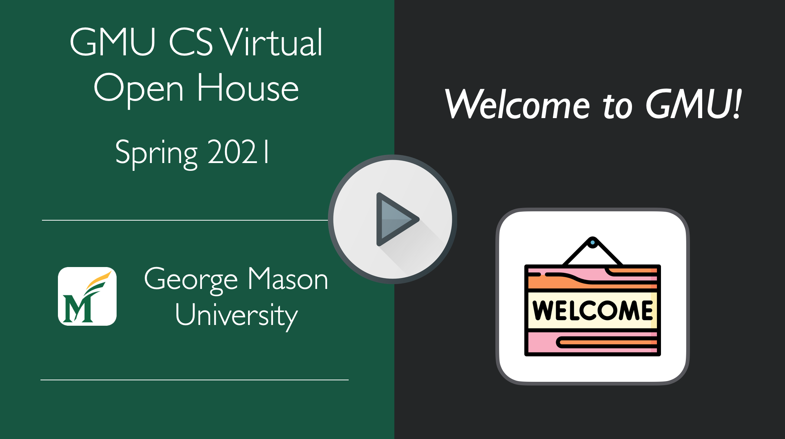

---
hide:
  - navigation 
  - toc        
---

## Welcome to GMU's CS Virtual Open House!
### March 15th - March 17th 2021

Congratulations on your acceptance into the Ph.D. Program in the Department of Computer Science at George Mason University! This website serves as a virtual landing page for the CS Virtual House Week, which will take place from Monday, March 15th - Wednesday March 17th. Please see the video below for an overview of the events, or check out the [schedule](https://cs.gmu.io/cs-open-house-21/schedule/) page.

---------

## Welcome Video

   

    
<iframe src='https://www.youtube.com/embed/a7Mt2MX2hhY' frameborder='0' allowfullscreen></iframe>

---------

## Open House Virtual Spaces

* **[Open House Website](https://cs.gmu.io/cs-open-house-21/):** Schedule, Information, and Resources
* **[Zoom]():** For Synchronous Virtual Meetings (See Schedule for Information about Zoom Links)
* **[Slack](https://join.slack.com/t/gmu-cs-open-house21/signup?x=x-p1867969768097-1879169347536-1868020516257):** Asynchronous chat with students and faculty. (You will receive an email invitation)

---------

<!--- ## A Welcome from the Department Chair --->

<!--- *Dear Students,* --->

<!--- *David's message goes here* --->

<!---*-Prof. David Rosenblum*--->

